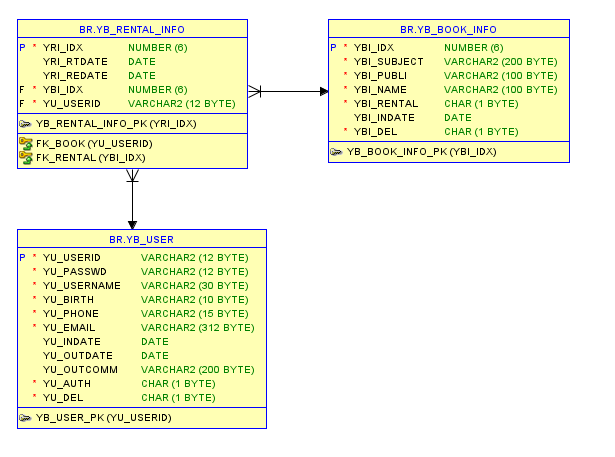
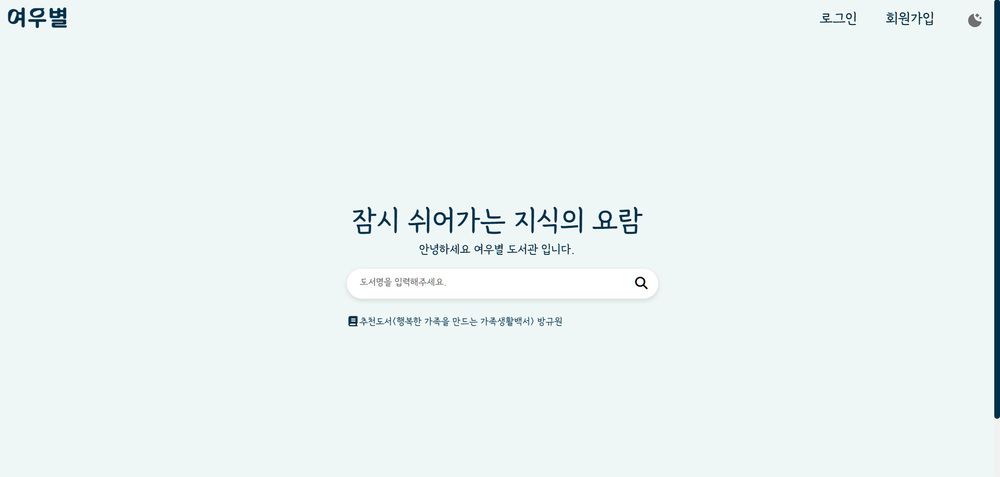
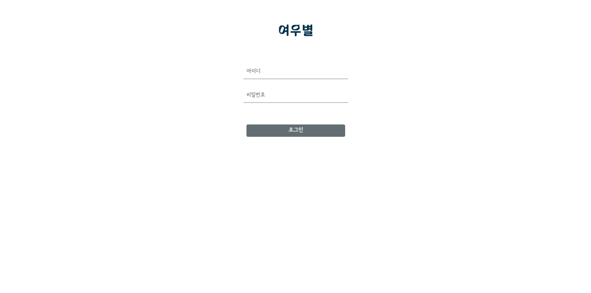
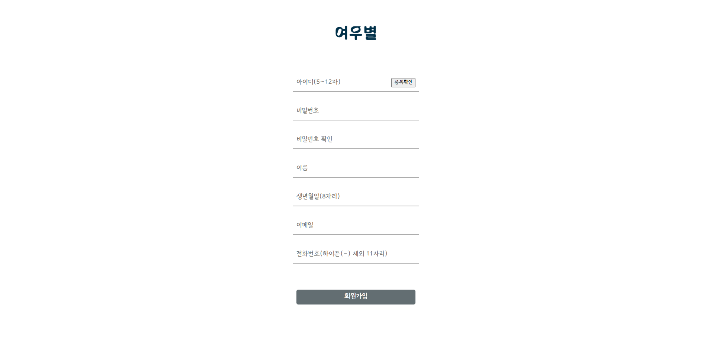
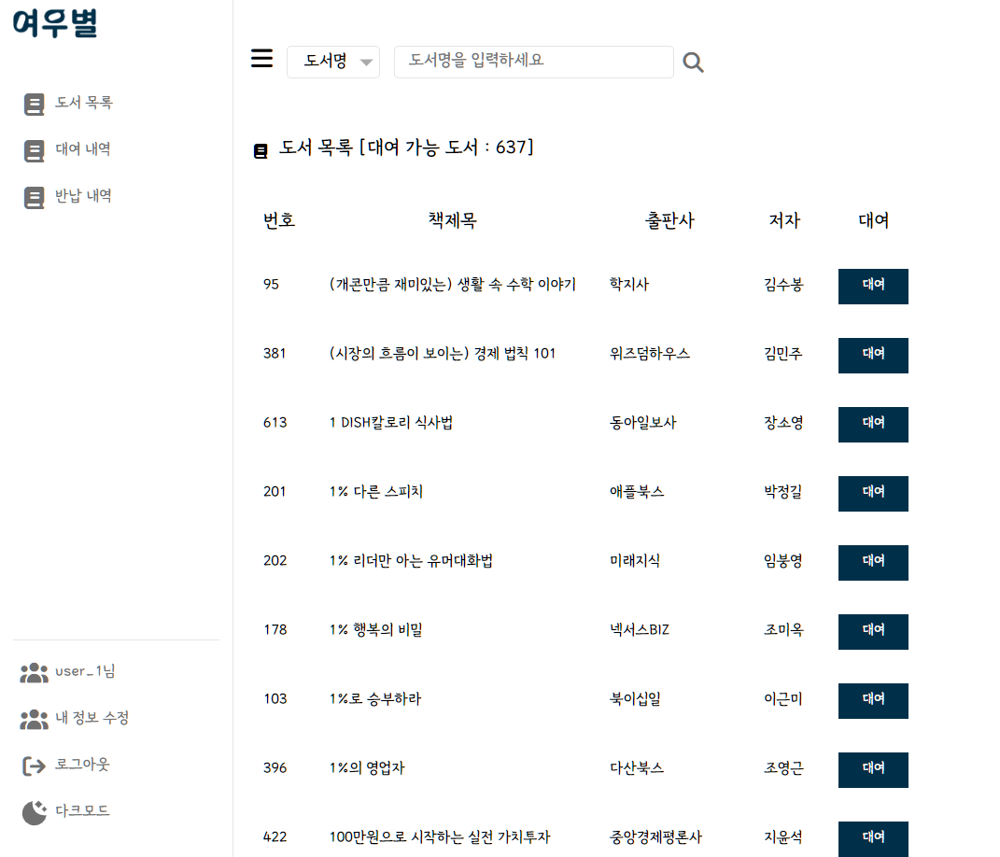
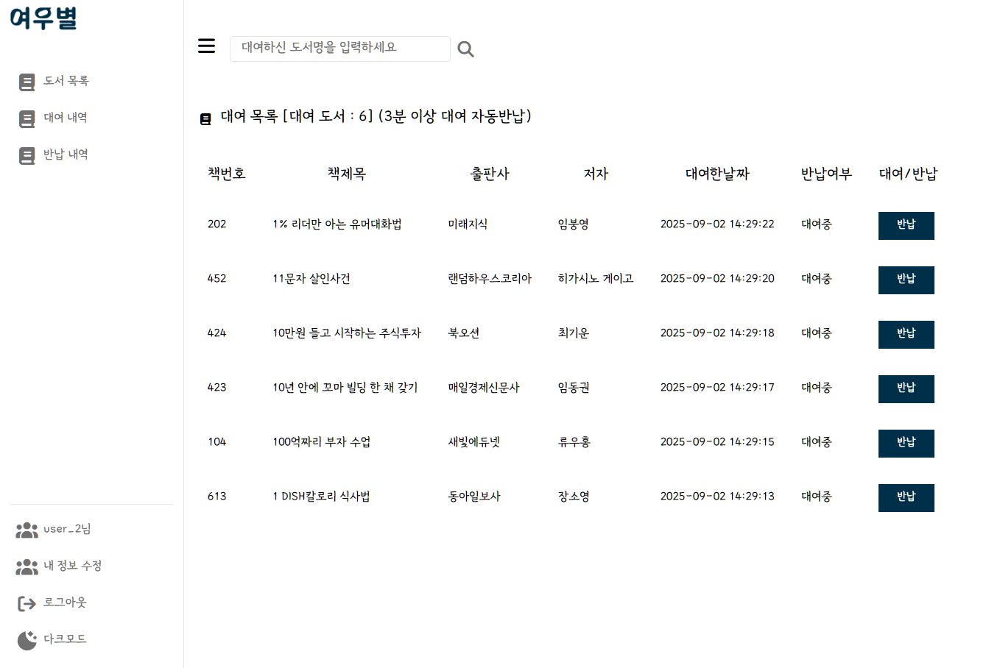
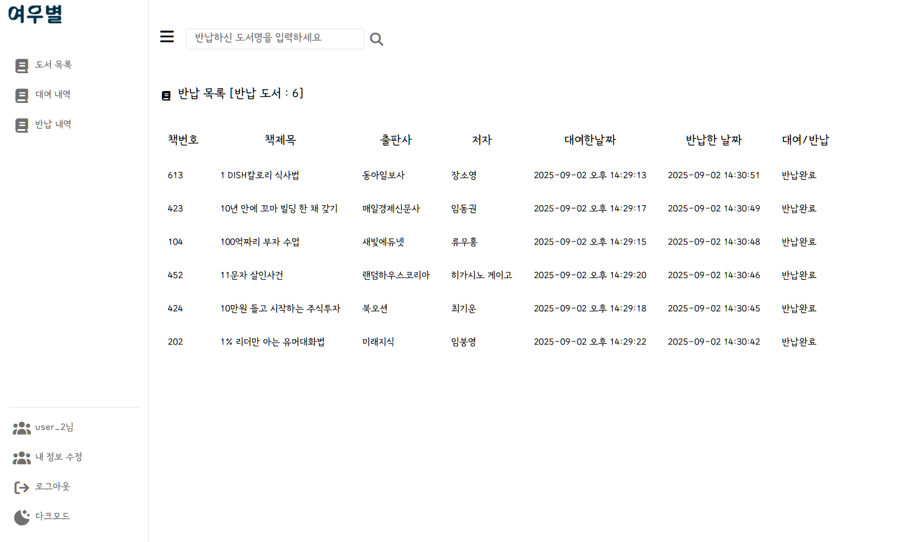
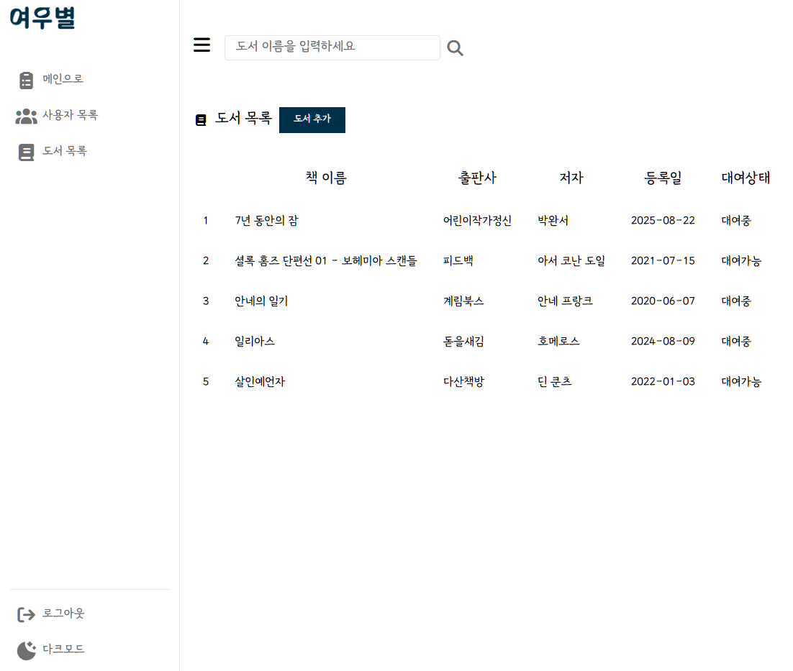
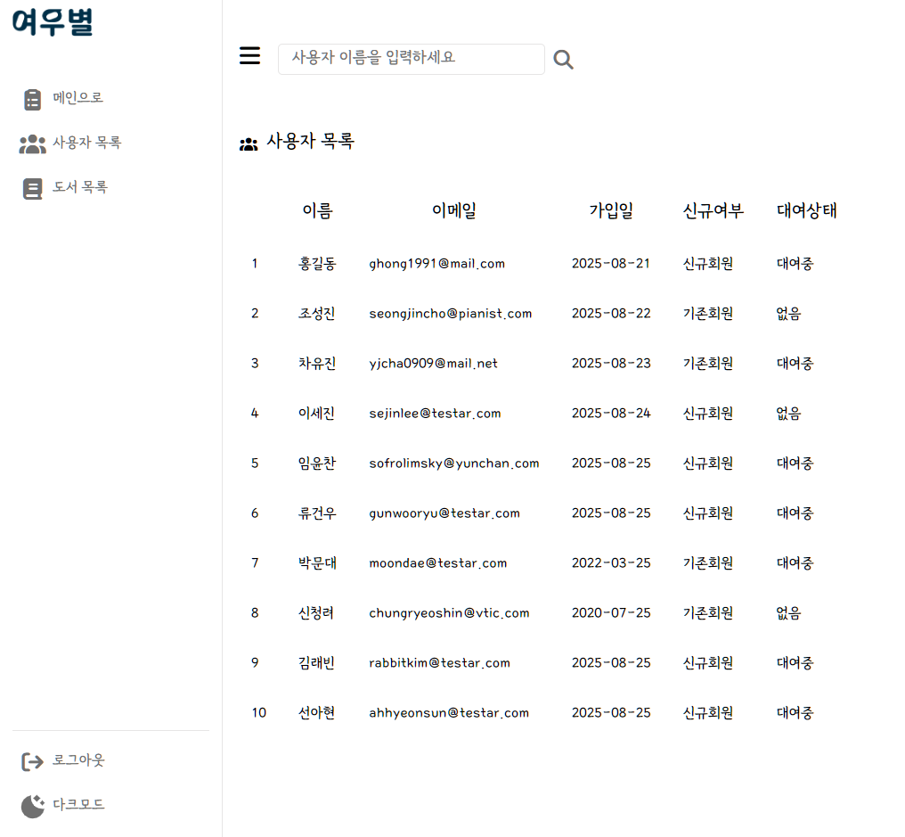
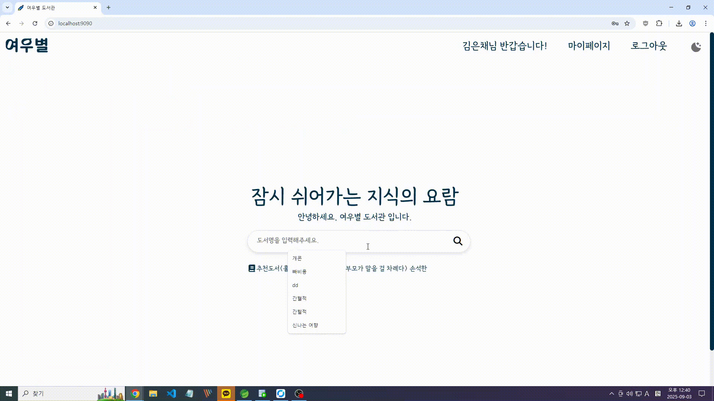

\# 📚✨ 여우별 도서관

> JDBC + Spring Boot + Gradle 기반 **풀스택 전자 도서관 서비스**  
> 사용자 → 로그인·검색·대여·반납  
> 관리자 → 회원·도서 관리 + 시스템 유지보수  

---

## 🌟 프로젝트 한눈에 보기
- 📅 **개발 기간**: 2025.08.21 ~ 2025.09.03  
- 👥 **팀 구성**: 김태경(팀장) · 황윤윤 · 김은채 · 조홍규  
- 🎯 **핵심 목표**  
  - **실제 서비스 수준**의 전자 도서관 구현  
  - **반응형 UI + 다크 모드**로 사용자 편의성 극대화  
  - **관리자 권한 분리**로 건전한 운영 보장

---

## ⚡ Tech Stack
| 영역 | 기술 |
|------|------|
| 🎨 Frontend | HTML, CSS, JavaScript (Vanilla) |
| 🔧 Backend | Spring Boot (Java 17) |
| 🗄️ Database | Oracle (JDBC 연동) |
| 📦 Build Tool | Gradle |
| 🤝 협업 | GitHub, KakaoTalk |

---

## 🗂️ Database ERD



### 📌 관계 설명
- N:N 관계
- 테이블: 사용자 테이블 / 도서 정보 테이블 / 대여 정보 테이블
- 한 사용자는 여러권의 도서를 대여할 수 있고, 한 권의 도서는 여러 사용자에게 대여 가능(시간차).
- BR_YB_BOOK_INFO가 중간 역할을 함
- PRIMARY KEY: YRI_IDX(대여 목록 번호), YBI_IDX(도서 목록 번호), YU_USERID(사용자 아이디)
- FOREIGN KEY: RENTAL_INFO.YRL_USERID → USER.YU_USERID, RENTAL_INFO.YRL_BOOKID → BR_YB_BOOK_INFO.YBI_IDX

---

## 💻 UI 미리보기

### 📖 메인
|  |

### 🔑 로그인 & 회원가입
| 로그인 | 회원가입 |
|--------|-----------|
|  |  |

### 📚 도서 검색 & 대여
| 검색 | 대여 | 반납 |
|------|------|------|
|  |  |  |

### 🛠 관리자 페이지
| 도서 관리 | 사용자 관리 |
|-----------|-------------|
|  |  |

---

## 🛠 주요 기능 & 코드 예시

### 1. 회원가입 & 로그인
```java
@RequestMapping("/Write")
	public  String  write( UserInfoDTO userinfoDTO, Model model ) {
		
		userinfoMapper.insertUser( userinfoDTO );
		
		model.addAttribute("msg", "회원가입이 완료되었습니다.");
		
		return "login";
	}
```
@PostMapping("/Login")
    public  String   login(
       HttpServletRequest    request,
       HttpServletResponse   response,
       HttpSession session
          ) {
       // 넘어온 로그인정보 처리
       String   yu_userid  =  request.getParameter("yu_userid");
       String   yu_passwd   =  request.getParameter("yu_passwd");
       
       UserInfoDTO  user  =  userinfoMapper.login(yu_userid, yu_passwd);
       
       if (user == null) {
           request.setAttribute("msg", "아이디 또는 비밀번호가 올바르지 않습니다.");
           return "login"; 
       }

       if ("N".equals(user.getYu_auth())) {
           userinfoMapper.reLogin(yu_userid);
           request.setAttribute("msg", "휴면이 해제되었습니다. 다시 로그인해 주세요.");
           return "login";
       }
         session.setAttribute("login", user);
         
         if ("S".equals(user.getYu_auth())) {
             return "redirect:/Admin/AdminNewIngList"; 
         } else if ("Y".equals(user.getYu_auth())) {
             return "redirect:/";
         } else {
             request.setAttribute("msg", "권한이 없습니다.");
             return "login";
         }    
    }
---

### 2. 도서 대여
```java
@RequestMapping("/Rent")
	public String rental(@RequestParam("ybi_idx") int ybi_idx , UserInfoDTO userDto ,String ybi_subject ,HttpSession session, RedirectAttributes re) {
		//booklistDTO bookid = booklistMapper.GetBookId(ybi_idx);
		/* String userId = (String) session.getAttribute("login_id"); */
		userDto = (UserInfoDTO) session.getAttribute("login");
		String yu_userid = userDto.getYu_userid();
		
		//하루에 ybi_idx 기준으로 같은책은 3번 , 다른책은 5번 초과로 빌릴수없음
		// 1. 현재 대여중인 책을 renCount에서 가져옴
	    int todayRentalCount = booklistMapper.renCount(yu_userid);

	    // 2. 오늘 같은 책(ybi_idx)을 빌린 횟수 확인 (반납 기록 포함)
	    int todaySameBookCount = rentalMapper.getTodaySameBookCount(yu_userid , ybi_idx);
	    
	    if(todaySameBookCount >= 3) {
	    	
	    	re.addFlashAttribute("sameRentalError" , "금일 동일도서는 총 3번까지 대여/반납이 가능합니다.\\n내일 다시 신청해주세요.");
	    	
	    }else if(todayRentalCount >=10 ){
	    	 re.addFlashAttribute("todayRentalError", "하루 총 10권까지 대여가 가능합니다.");
	    	
	    }else{
	    	final rentalDTO rental = new rentalDTO();
	    	rental.setYbi_idx(ybi_idx);
	    	rental.setYu_userid(yu_userid);
	    	rentalMapper.insertRental(rental);
			
			//대여시점으로 시작
			Runnable autoReturnTask = () ->{
				rentalMapper.updateRental(rental);
				System.out.println("사용자:" + yu_userid + " 도서명:"  + ybi_subject + " 기간만료반납이 완료되었습니다" );
				
			};
			
			//Task스케줄러
			//3분 뒤 반납
			long delayTime = (3 * 60 * 1000L) + 1000L;
			//Instant.now() 현재시각을 Instant객체로 나노초 단위까지 계산 후
			// 현재시간 + delayTime = 반납시간
			Instant scheduledInstant = Instant.now().plusMillis(delayTime);
			taskScheduler.schedule(autoReturnTask, scheduledInstant);
			
			System.out.println("사용자:" + yu_userid + " 도서명:"  + ybi_subject + "을(를) 대여하였습니다." );
			
			re.addFlashAttribute("subject",ybi_subject);
	    }
		
	    return "redirect:/RentalList";
	    
	}
```

---

### 3. 도서 반납
```java
@RequestMapping("/ReturnBook")
		public String Returnbook(UserInfoDTO userDto ,rentalDTO rentalDTO ,String ybi_subject, HttpSession session , RedirectAttributes re) {
		//login_id 세션 불러오기
		/* String yu_userid = (String) session.getAttribute("login_id"); */
		
		 userDto = (UserInfoDTO) session.getAttribute("login");
		 String yu_userid = userDto.getYu_userid();

		 
		 
		//유저이름 ,반납일 저장
		rentalDTO.setYu_userid(yu_userid);
		rentalMapper.updateRental(rentalDTO);
		System.out.println("사용자 : " + yu_userid + "도서명 " + ybi_subject + "을(를)직접 반납했습니다.");
		re.addFlashAttribute("subject",ybi_subject);
		return "redirect:/ReturnList";	
	}
```

---

### 4. 관리자 기능(사용자 목록 조회)
```java
@RequestMapping("/Admin/AdminUserList")
	public ModelAndView adminUserList(AdminSearchDTO params, AdminUserDTO adminUserDto) {
		String and_str = "";
		String pagingUrl = "/Admin/AdminUserList?";
		
		// userList Data
		List<AdminUserDTO> userList = adminUserMapper.getUserList(adminUserDto,params);
		// paging Data
		int totalCount = adminUserMapper.count(adminUserDto,and_str);
		
		//Pagination 객체 생성 및 SearchDTO에 주입
		AdminPagination pagination = new AdminPagination(totalCount, params);
		params.setPagination(pagination);
				
		//페이지가 0 보다 작을경우 1 로 설정 (이전 버튼 누를시 -1 -2.. 방지)
		if(params.getPage() < 0) {
			params.setPage(1);
		}
		
		ModelAndView mv = new ModelAndView();
		
		mv.addObject("pagingUrl",pagingUrl);
		mv.addObject("userList",userList);
		mv.addObject("searchDTO",params);
		mv.addObject("totalCount",totalCount);
		mv.setViewName("admin/adminUserList");
		return mv;
	}
```

---

### 5. SQL
```sql
CREATE TABLE YB_USER(
	YU_USERID 		VARCHAR2(12)  PRIMARY KEY NOT NULL,
	YU_PASSWD	  	VARCHAR2(12)  NOT NULL,
	YU_USERNAME     VARCHAR2(30)  NOT NULL,
	YU_BIRTH		VARCHAR2(10)  NOT NULL,
	YU_PHONE		VARCHAR2(15)  NOT NULL,
	YU_EMAIL		VARCHAR2(312) NOT NULL,
	YU_INDATE       DATE          DEFAULT SYSDATE,
	YU_OUTDATE		DATE		  ,
	YU_OUTCOMM		VARCHAR2(200) ,
	YU_AUTH	 		CHAR		  NOT NULL,
	YU_DEL			CHAR		  NOT NULL
);


CREATE TABLE YB_BOOK_INFO(
	YBI_IDX		NUMBER(6)			PRIMARY KEY NOT NULL,
	YBI_SUBJECT	VARCHAR2(200)		NOT NULL,
	YBI_PUBLI	VARCHAR2(100)		NOT NULL,
	YBI_NAME	VARCHAR2(100)		NOT NULL,
	YBI_RENTAL	CHAR				NOT NULL,
	YBI_INDATE	DATE				DEFAULT SYSDATE,
	YBI_DEL		CHAR				NOT NULL
);

CREATE TABLE YB_RENTAL_INFO(
	YRI_IDX		NUMBER(6)		PRIMARY KEY NOT NULL,
	YRI_RTDATE	DATE			DEFAULT SYSDATE,
	YRI_REDATE	DATE			,
	YBI_IDX		NUMBER(6)		NOT NULL,
	YU_USERID	VARCHAR2(12)	NOT NULL,
	
	CONSTRAINT FK_RENTAL FOREIGN KEY  (YBI_IDX) REFERENCES   YB_BOOK_INFO(YBI_IDX) ,
    CONSTRAINT FK_BOOK FOREIGN KEY (YU_USERID) REFERENCES  YB_USER(YU_USERID)
);
```

---

## 🎥 시연 GIF

### 🔑 로그인 & 회원가입  
  

### 📚 도서 검색 & 대여  


### 🛠 관리자 페이지  


---

## ⚡ 실행 방법

### 1. 프로젝트 클론
```bash
git clone https://github.com/blueprelude/Yeowoobyeol.git
cd library
```

### 2. DB 설정
```
spring.application.name=Yeowoobyeol

server.servlet.context-path=/

# server 의 port 번호
server.port = 9090

# jsp 가 저장될 폴더이름
spring.mvc.view.prefix = /WEB-INF/views/
spring.mvc.view.suffix = .jsp

# JSP 수정시 서버 재시작없이 바로 적용할 수 있게 설정
server.servlet.jsp.init-parameters.development = true

# mapper.xml 경로 설정
#    /src/main/resources/mapper/boardMapper.xml  폴더와 xml파일 생성
mybatis.mapper-locations=classpath:mapper/**/*Mapper.xml           

# datasource 설정
spring.datasource.driver-class-name=oracle.jdbc.OracleDriver

# real
spring.datasource.url=jdbc:oracle:thin:@192.168.0.41:1521:xe
# local
# spring.datasource.url=jdbc:oracle:thin:@localhost:xe
spring.datasource.username=br
spring.datasource.password=1234
```

### 3. 빌드 & 실행
```bash
./gradlew build
./gradlew bootRun
```

접속 경로  
- 사용자: http://localhost:9090
- 관리자: ADMIN 계정으로 로그인  

---

## 👥 팀원 역할 분담
- **김태경(팀장)**: 관리자 페이지 CSS, 검색 결과 페이지 CSS, 다크 모드 적용(로그인, 회원가입 페이지 제외)
- **황윤윤**: DB 설계, 사용자/도서 목록 DB 처리
- **김은채**: 회원가입/로그인 기능과 CSS
- **조홍규**: 도서 검색, 도서 대여/반납 기능과 홈 화면 CSS

---

## 📝 향후 개선점
- 추천 알고리즘 기반 도서 추천 기능  
- 대출 연장 서비스  
- 관리자 통계 대시보드 고도화  
- JWT 인증 및 HTTPS 적용  
- 클라우드 서버 (AWS 등) 배포  

---

## 🎯 개발 동기
단순한 CRUD 프로젝트가 아니라,  
**실제 서비스처럼 쓸 수 있는 전자 도서관**을 만들고자 했습니다.  
- **JDBC 기반 DB 연동**  
- **반응형 UI + 다크 모드**  
- **사용자 & 관리자 권한 분리**

👉 이를 통해 **현업에서 바로 적용 가능한 경험**을 쌓는 것을 목표로 했습니다.  
